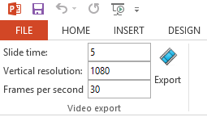

#PowerPoint video exporter
Microsoft PowerPoint can export your slides to video. However you can only chose between three pre-defined resolutions (1280 x 720, 852 x 480, 424 x 240). This exporter allows you to export with desired settings (even with different resolutions).

